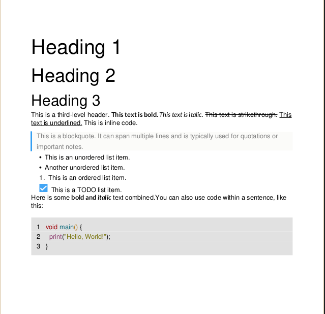
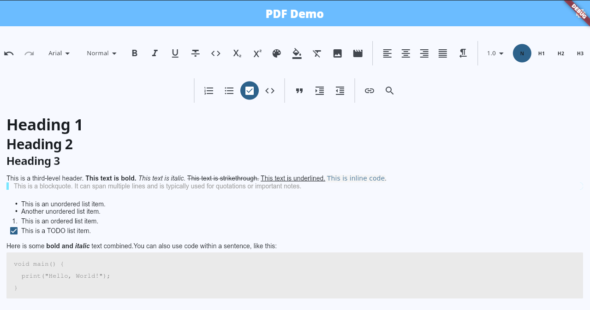

# Flutter Quill to PDF

**Flutter Quill to PDF** is a powerful package designed to convert documents created with **Flutter Quill** (based on Deltas) into high-quality PDF files. This package offers a wide range of customization options, allowing developers to adjust page formatting (width, height, and margins), customize fonts, text styles, and add elements such as images, videos, lists, blockquotes, and code blocks. Additionally, it supports the generation of custom widgets to integrate PDF content directly into the **Flutter** user interface. 

<details>
    <summary>Show/Hide screenshots</summary>
    <h4>PDF generated</h4>
    
    <h4>Content used to generate the PDF</h4>
    
</details>

> [!TIP]
> If you are using the version **v2.2.9** or a minor version, [see the breaking changes that were maded in **v2.3.0**](https://github.com/CatHood0/flutter_quill_to_pdf/blob/master/CHANGELOG.md#230)

## Resources

[code-block customization](https://github.com/CatHood0/flutter_quill_to_pdf/blob/master/doc/code-block.md)
[blockquote customization](https://github.com/CatHood0/flutter_quill_to_pdf/blob/master/doc/blockquote.md)
[theme customization](https://github.com/CatHood0/flutter_quill_to_pdf/blob/master/doc/theme.md)
[header customization](https://github.com/CatHood0/flutter_quill_to_pdf/blob/master/doc/header.md)

### Creating your PDF file  

#### First: personalize the settings of the page (`height`, `width` and `margins`)

```dart
final PDFPageFormat pageFormat = PDFPageFormat(
   width: ..., //max width of the page
   height: ..., //max height of the page,
   marginTop: ...,
   marginBottom: ...,
   marginLeft: ...,
   marginRight: ...,
);
// or use
final PDFPageFormat pageFormat = PDFPageFormat.all(
   width: ..., //max width of the page
   height: ..., //max height of the page,
   margin: ..., //will set the property to the others margins
);
```

#### Second: create your PDFConverter

```dart
import 'package:flutter_quill_to_pdf/flutter_quill_to_pdf.dart':

final pdfConverter = PDFConverter(
    backMatterDelta: null,
    frontMatterDelta: null,
    // set a default Direction to your pdf widgets
    textDirection: Directionality.of(context), 
    // if you support web platform, you will need to pass this param, 
    // since fetching images in web works differently
    isWeb: kIsWeb,
    pageFormat: pageFormat, // pass your page format here
    themeData: null, // your custom theme for the document
    listTypeWidget: ListTypeWidget.stable, // or ListTypeWidget.modern
    listLeadingBuilder: (String type, int level, Object? args) => null,
    enableCodeBlockHighlighting: true, 
    customHeadingSizes: [50, 45, 40, 35, 30], // override default heading sizes
    isLightCodeBlockTheme: false,
    // your custom theme for code-block (see code-block customization resource)
    customCodeHighlightTheme: <String, pw.TextStyle>{},
    blockquotePadding: null, // override default implementation
    blockquoteBoxDecoration: null, // override default implementation
    inlineCodeStyle: null, // override default implementation
    codeBlockBackgroundColor: null, // override default implementation
    blockquoteTextStyle: null, // override default implementation
    codeBlockNumLinesTextStyle: null, // override default implementation
    codeBlockFont: null, // override default implementation
    onDetectBlockquote: (pr, args) {
      return YourPdfWidget();
    },
    onDetectCodeBlock: null,
    document: _quillController.document.toDelta(),
    fallbacks: [...your global fonts],
    onRequestFontFamily: (FontFamilyRequest familyRequest) {
        return FontFamilyResponse(
          fontNormalV: <anyFontThatYouWant>, 
          boldFontV: familyRequest.isBold ? <yourBoldFontFamily> : null,
          italicFontV: familyRequest.isItalic ? <yourItalicFontFamily> : null,
          boldItalicFontV: familyRequest.isItalic && familyRequest.isBold ? <yourBoldItalicFontFamily> : null,
          fallbacks: const <pw.Font>[],
        );
    },
);
```

### Creating the PdfoDocument/widgets:

```dart
import 'dart:io';
import 'package:flutter_quill_to_pdf/flutter_quill_to_pdf.dart';
import 'package:pdf/pdf.dart';

// return a pdf Document
final doc = await pdfConverter.createDocument();
// Generate the widgets without adding them to a pdf document
final pw.Widget? pwWidget = await pdfConverter.generateWidget(
    maxWidth: pwWidgetWidth,
    maxHeight: pwWidgetHeight,
);
// with this, we can use doc.save() to write the bytes into a File in a Storage Path
```

## Supported Attributes 

#### Inlines

- Size
- Bold
- Link
- Color
- Italic
- Underline
- inline code 
- Font family
- Strikethrough
- Background Color

#### Blocks 
##### Combinable with other Block/Non block Attributes 

- Align
- Indent
- Direction
- Line-height

##### Exclusives

- Header
- Code-block
- Blockquote
- Embed image (Base64, URL, and common storage paths)
- Embed video (Just the URL of the Video will be pasted as a text)
- List (Multilevel List too)
  1. Ordered List 
  *  Bullet List
  - [x] CheckBox List

## No supported Attributes

- Superscript/Subscript (status: being planned)
- Embed formula (status: being planned)

You can contribute reporting issues or requesting to add new features on [flutter_quill_to_pdf](https://github.com/CatHood0/flutter_quill_to_pdf)
