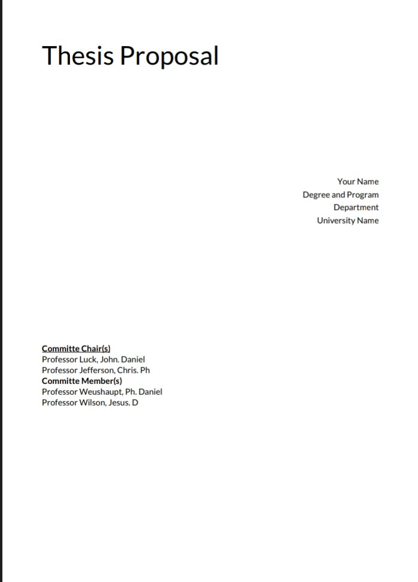

# Quill Delta to PDF

This package allows you to create PDFs using deltas from Quill.

You can configure:

* `DeltaAttributesOptions` (this are attributes that will appear in the delta if certain attributes are not found in the delta.
* The fonts that the PDF can use for your text.
* `CustomConverter`, which helps you create custom PDF widgets using custom regular expressions.
* Optional front matter and back matter.
* Even the page format.

> By default, the delta when create document are processed by a local implementation that use `DeltaAttributesOptions`to apply custom attrs make more easy add a attribute to whole delta. If you want just make you're own implementation, or just use a default delta, use `PDFConverter(...params).createDocument(shouldProcessDeltas: false)`




### Suppoted

* Image embed (Files path yet)
* Header
* Link
* Inline attributes (font, size, bold, italic, underline)
* line-height (custom attribute used from this package)
* Align
* List (check, bullet, ordered)

### Add dependency

```yaml
dependencies: 
    quill_to_pdf: ^1.0.0
```

### Import package

```dart
import 'package:quill_to_pdf/quill_to_pdf.dart':
```

### Using pdf converter and required params

```dart
PDFConverter pdfConverter = PDFConverter(
    backMatterDelta: null,
    frontMatterDelta: null,
    customConverters: [],
    document: _quillController.document.toDelta(),
    fallbacks: [...your global fonts],
    onRequestBoldFont: (String fontFamily) async {
       ...your local font implementation
    },
    onRequestBoldItalicFont: (String fontFamily) async {
       ...your local font implementation
    },
    onRequestFallbackFont: (String fontFamily) async {
       ...your local font implementation
    },
    onRequestItalicFont: (String fontFamily) async {
       ...your local font implementation
    },
    onRequestFont: (String fontFamily) async {
       ...your local font implementation
    },
    params: PDFConverterParams(...),// this decide the page format
);
final pw.Document? document = await pdfConverter.createDocument();
```

## Not support yet

* Images links
* Code block
* Blockquote
* text Color 
* background color
* indented text,
* indented list (bullet, unordered, check)
* formula 

You can contribute to this package to: 